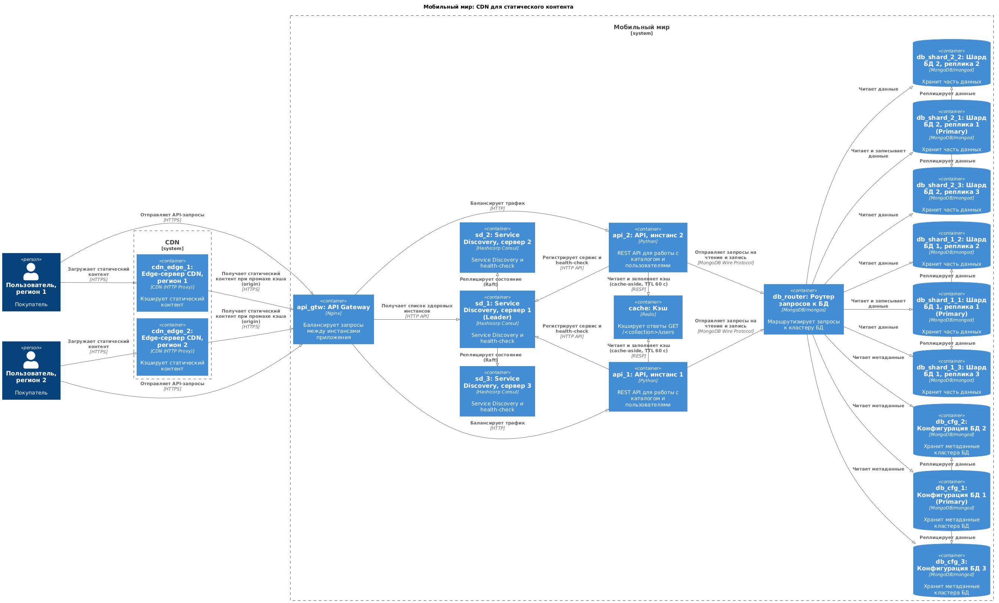
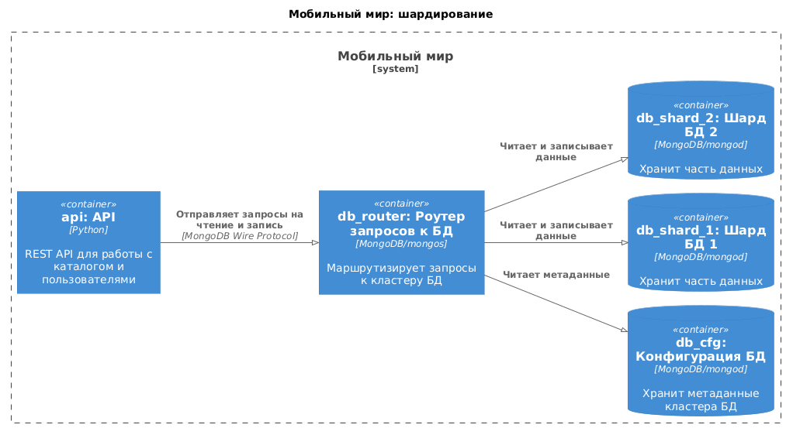
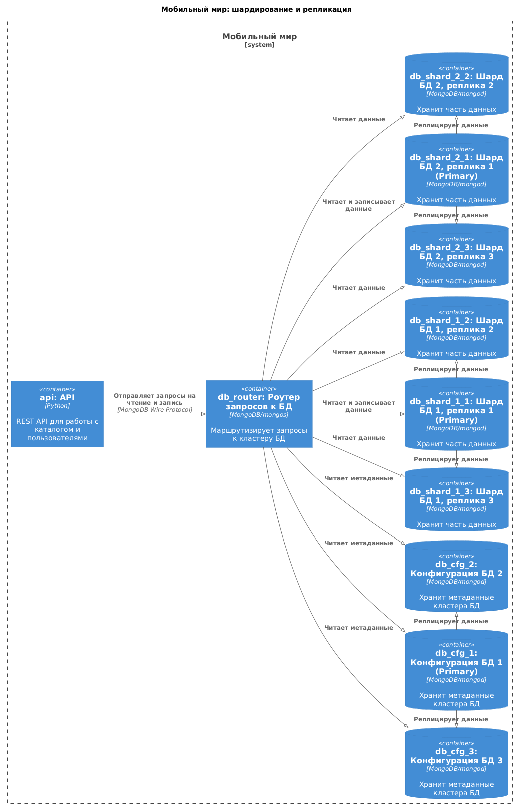
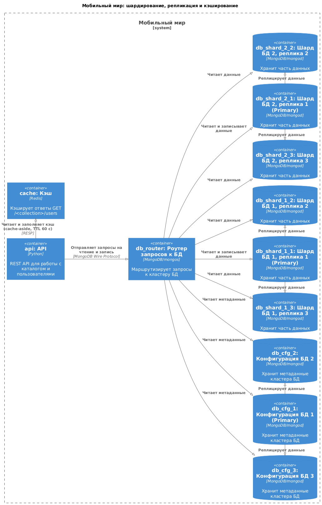
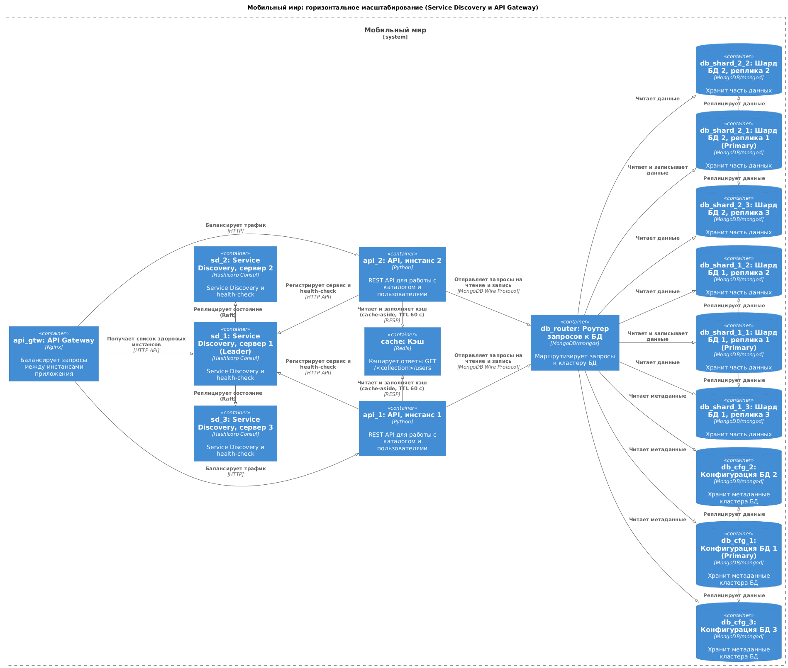

# Спринт 4

Проекты для заданий 2, 3 и 4 расположены в `sharding/`, `sharding-repl/` и `sharding-repl-cache/` соответственно. Диаграммы расположены в `docs/architecture/`. *Я использовал PlantUML/C4 для создания диаграмм -- визуально результат почти не отличается от того, что можно сделать с помощью draw.io/diagrams.net.*

## Финальное решение

Диаграмма: 

Директория: `sharding-repl-cache/`.

### Как запустить

```shell
cd sharding-repl-cache
docker compose up -d
./scripts/init.sh
```

Приложение будет доступно по адресу: <http://localhost:8080>. Подробная инструкция для запуска и проверки -- в [README](sharding-repl-cache/README.md) проекта.

*Начиная с 8.0.21 MongoDB отказывается стартовать на ядрах Linux >= 6.19. Я использовал образ `dh-mirror.gitverse.ru/mongo:8.0.20`. См. [SERVER-121912](https://jira.mongodb.org/browse/SERVER-121912) и [SERVER-125742](https://jira.mongodb.org/browse/SERVER-125742).*

## Исходное состояние

См. [README](asis/README.md).

*Я внес несколько исправлений для удобства: перенес исходное приложение в отдельную директорию; переделал заполнение данными так, чтобы оно выполнялось автоматически; добавил README; добавил диаграмму из описания системы.*

## Задание 1

- [x] **Схема 1 (Шардирование):** 
- [x] **Схема 2 (Репликация):** 
- [x] **Схема 3 (Кэширование):** 

## Задание 2

- [x] Скопировать исходный проект в директорию `sharding`.
- [x] В `compose.yaml` задать имя проекта `name: sharding`.
- [x] Реализовать шардирование по схеме 1.
- [x] Подготовить инструкцию для запуска в файле `README.md`.
- [x] Проверить приложение.

## Задание 3

- [x] Скопировать проект из предыдущего задания в директорию `sharding-repl`.
- [x] В `compose.yaml` задать имя проекта `name: sharding-repl`.
- [x] Реализовать репликацию по схеме 2.
- [x] Подготовить инструкцию для запуска в файле `README.md`.
- [x] Проверить приложение.

## Задание 4

- [x] Скопировать проект из предыдущего задания в директорию `sharding-repl-cache`.
- [x] В `compose.yaml` задать имя проекта `name: sharding-repl-cache`.
- [x] Реализовать кэширование по схеме 3.
- [x] Подготовить инструкцию для запуска в файле `README.md`.
- [x] Проверить приложение.

## Задание 5

- [x] **Схема 4 (Service Discovery & API Gateway):** 

## Задание 6

- [x] **Схема 5 (CDN):** 

## Использование ИИ

- Проверка текста на опечатки и прочие ошибки.
- Проверка скриптов и диаграмм.
