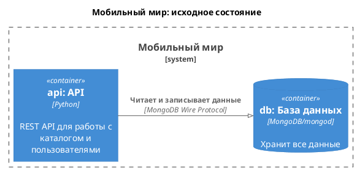

# Мобильный мир: исходное состояние



## Как запустить

Выполнить команду:

```shell
docker compose up -d
```

MongoDB заполняется данными автоматически при первом запуске (скрипт `scripts/mongo-init.js` выполняется из `/docker-entrypoint-initdb.d/`), если том `db_data` отсутствует. Для повторного наполнения нужно удалить том:

```shell
docker compose down -v
docker compose up -d
```

## Как проверить

- Приложение: <http://localhost:8080>
- Документация: <http://localhost:8080/docs>
